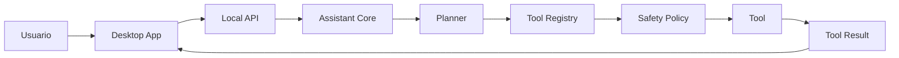

# Gravity AI Architecture

Gravity AI e organizado como um monorepo com limites claros entre experiencia desktop, runtime do assistente, contratos compartilhados e plugins.

## Camadas

- `apps/desktop`: shell Tauri/React, responsavel pela experiencia visual e comunicacao com a API local.
- `backend/src/gravity_ai/core`: contratos centrais, orquestracao e politicas que nao dependem de UI.
- `backend/src/gravity_ai/tools`: registro e execucao de ferramentas. Toda acao real passa por aqui.
- `backend/src/gravity_ai/plugins`: descoberta de plugins, manifesto, permissoes e comandos.
- `backend/src/gravity_ai/memory`: memoria de curto prazo, longo prazo, preferencias e historico.
- `backend/src/gravity_ai/storage`: persistencia SQLite inicial, isolada atras de repositorios.
- `backend/src/gravity_ai/llm`: adapters de provedores de modelos.
- `backend/src/gravity_ai/api`: API local para o desktop.

## Fluxo principal

## Regras de dependencia

- O frontend depende apenas dos contratos publicados e da API local.
- Ferramentas nao conhecem React, Tauri ou provedores de LLM.
- Plugins declaram capacidades por manifesto antes de qualquer execucao.
- Storage nao decide comportamento de produto; ele apenas persiste dados.
- Provedores LLM sao adapters substituiveis.

